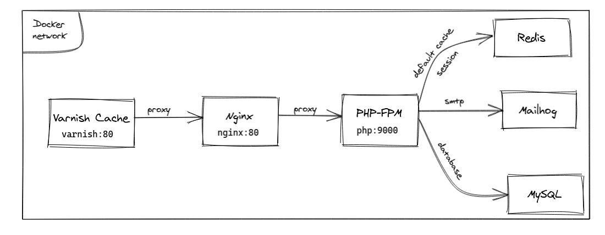

# Dockerize với mangeto 2

## 1. Tổng quan

Magento 2 cần nhiều service chạy song song, tổng quan sẽ cần các service sau:

Service|Version|Mục đích
-|:-:|-
PHP-FPM|8.3|Thực thi code php
NGINX|latest|Web service đóng vai trò cửa ngõ cho ứng dụng và điều hướng request tới PHP-FPM
MariaDB|10.2-10.6|Cơ sở dữ liệu quan hệ, có thể sử dụng MySQL
Redis|latest|Cơ sử dữ liệu phi quan hệ, để lưu trữ cache
Varnish||Một Page cache service giúp tối ưu thời gian tải trang và chỉ tải lại những phần cần thiết
Elasticsearch|7.x|Search Engine được sử dụng bởi Magento
---
#### Biểu đồ phụ thuộc


## 2. Chuẩn bị

### a. Tải magento open source (bản community)
Sử dụng composer, thực hiện theo [magento doc](https://experienceleague.adobe.com/en/docs/commerce-operations/installation-guide/composer)
```bash
composer create-project --repository-url=https://repo.magento.com/ magento/project-community-edition <install-directory-name> --ignore-platform-reqs
```

`--ignore-platform-reqs` flag dùng thông báo cho composer biết là cài đặt không cần quan tâm tới requirement của môi trường

Do cài đặt bằng composer, tức là folder vendor đã được cài đặt

### b. Viết Dockerfile
