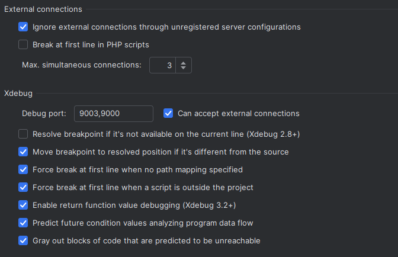
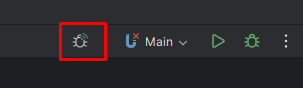
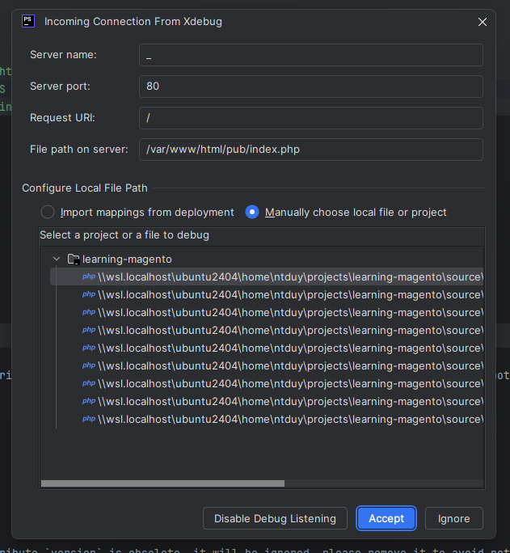
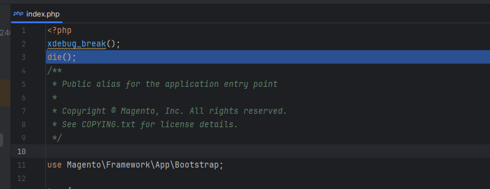
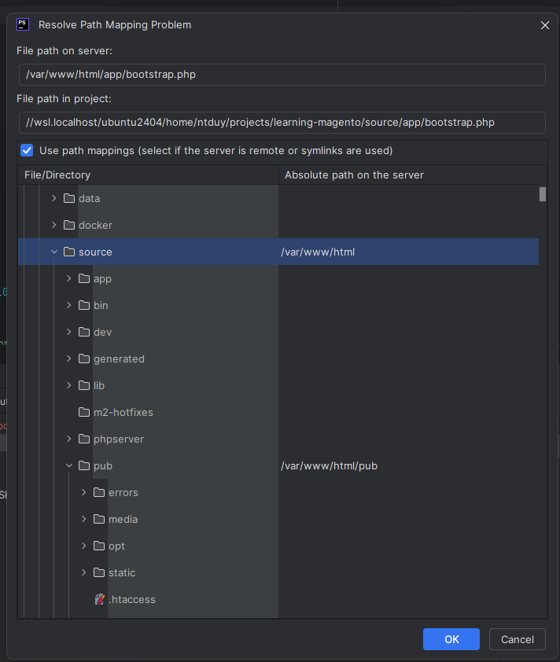

# Dockerize với mangeto 2

## 1. Tổng quan

Magento 2 cần nhiều service chạy song song, tổng quan sẽ cần các service sau:

Service|Version|Mục đích
-|:-:|-
PHP-FPM|8.3|Thực thi code php
NGINX|latest|Web service đóng vai trò cửa ngõ cho ứng dụng và điều hướng request tới PHP-FPM
MariaDB|10.2-10.6|Cơ sở dữ liệu quan hệ, có thể sử dụng MySQL
Redis|latest|Cơ sử dữ liệu phi quan hệ, để lưu trữ cache
Varnish|6.x|Một Page cache service giúp tối ưu thời gian tải trang và chỉ tải lại những phần cần thiết
Elasticsearch|7.x|Search Engine được sử dụng bởi Magento
phpmyadmin (*)|latest|Hệ quản trị CSDL để thao tác với database
mailpit (*)|latest|Test mail server dành cho việc gửi nhận email ở local
---

> *(\*) : Optional - có thể cài hoặc không*

### Tổ chức các folder và file

|#|#|#|#|#|
|--|--|--|--|--|
|my_docker/
||docker/
|||dbdata/||Dữ liệu của MySQL
|||esdata/||Dữ liệu của Elasticsearch
|||nginx/
||||nginx.conf|Config cho webserver
|||php/
||||custom.ini|Config custom cho php
||||custom-xdebug.ini|Config cho xdebug
|||composer/
||||auth.json|Config api key cho composer
|||varnish/
||||default.vcl|Config cho varnish, được generate qua magento command
||source/
|||...||Code magento
|||nginx.conf.sample||Config nginx có sẵn cung cấp bởi magento
|||Dockerfile||Khai báo cho build image
||docker-compose.yml|||Khai báo cho khởi chạy các container
||.env|||Khai báo biến môi trường dùng cho `docker-compose.yml`. Có thể dùng hoặc không.

## 2. Build Magento 2 docker image

### a. Tải magento open source (bản community)
Sử dụng composer, thực hiện theo [magento doc](https://experienceleague.adobe.com/en/docs/commerce-operations/installation-guide/composer)
```bash
composer create-project --repository-url=https://repo.magento.com/ magento/project-community-edition path/to/install/folder --ignore-platform-reqs
```
- *--ignore-platform-reqs*: flag dùng thông báo cho composer biết là cài đặt không cần quan tâm tới requirement của môi trường
- *path/to/install/folder*: Đường dẫn tới folder chứa code

### b. Viết Dockerfile
```Dockerfile
### File Dockerfile

FROM php:8.3-fpm-alpine

# Set working directory
WORKDIR /var/www/html

RUN mv "$PHP_INI_DIR/php.ini-production" "$PHP_INI_DIR/php.ini"

# Install necessary dependencies for Magento
RUN apk update && apk add --no-cache \
    bash \
    curl \
    git \
    icu-dev \
    libpng-dev \
    libjpeg-turbo-dev \
    freetype-dev \
    libzip-dev \
    libxml2-dev \
    oniguruma-dev \
    libxslt-dev \
    supervisor \
    mysql-client \
    openssh \
    g++ \
    autoconf \
    make \
    shadow \
    zlib-dev \
    linux-headers \
    && docker-php-ext-configure gd \
        --with-freetype \
        --with-jpeg \
    && docker-php-ext-install \
        bcmath \
        gd \
        intl \
        mbstring \
        opcache \
        pdo_mysql \
        soap \
        xsl \
        zip \
        sockets

# Install Xdebug (optional)
RUN pecl install xdebug && docker-php-ext-enable xdebug

# Install Composer
RUN curl -sS https://getcomposer.org/installer | php -- --install-dir=/usr/local/bin --filename=composer

COPY . .

CMD ["php-fpm"]
```

File `.dockerignore` trong project root giúp bỏ đi các phần thừa khi build image, giúp giảm dung lượng image

```
# Ignore everything by default
*

# Allow essential files and directories
!app/
!bin/
!lib/
!phpserver/
!pub/
!setup/
!var/
!generated/
!nginx.conf.sample
!docker-compose.yml

# Allow important files in the root directory
!auth.json
!composer.json
!composer.lock
!.env
!.gitignore
!.magento.env.yaml
!package.json
!package-lock.json
!vendor/.htaccess

# Exclude unnecessary files and directories
.git/
node_modules/
var/cache/
var/composer_home/
var/page_cache/
var/view_preprocessed/
pub/static/frontend/
pub/static/adminhtml/
pub/media/tmp/
pub/media/catalog/
generated/code/
generated/metadata/

# Ignore IDE-specific and OS-specific files
.idea/
.vscode/
.DS_Store
Thumbs.db

# Ignore Docker-specific files
.dockerignore
Dockerfile

# Ignore logs and temp files
*.log
*.tmp
*.swp
*.bak
*.orig
```

### c. Build image

```bash
cd /path/to/my_docker/source
docker build -t image_name .
```

## 2. Khởi chạy Docker Container

#### a. Viết docker-compose.yml

```yml
version: '3.8'

services:
  app:
    image: learning-docker/magento-v3
    restart: unless-stopped
    volumes:
      - ./docker/php/custom.ini:/usr/local/etc/php/conf.d/custom.ini
      - ./docker/php/custom-xdebug.ini:/usr/local/etc/php/conf.d/docker-php-ext-xdebug.ini
      - ./docker/composer/auth.json:/var/www/html/var/composer_home/auth.json
      - ./source:/var/www/html
    environment:
      BASE_URL: ${APP_BASE_URL}
      DB_HOST: ${MYSQL_HOST}
      DB_NAME: ${MYSQL_DATABASE}
      DB_USER: ${MYSQL_USER}
      DB_PASSWORD: ${MYSQL_PASSWORD}
      ADMIN_EMAIL: ${APP_ADMIN_EMAIL}
      ADMIN_FIRSTNAME: ${APP_ADMIN_FIRSTNAME}
      ADMIN_LASTNAME: ${APP_ADMIN_LASTNAME}
      ADMIN_USER: ${APP_ADMIN_USER}
      ADMIN_PASSWORD: ${APP_ADMIN_PASSWORD}
      ADMIN_FRONT_NAME: ${APP_ADMIN_FRONT_NAME}
      LANGUAGE: ${APP_LANGUAGE}
      CURRENCY: ${APP_CURRENCY}
      TIMEZONE: ${APP_TIMEZONE}
      SEARCH_ENGINE: ${APP_SEARCH_ENGINE}
      ES_HOST: ${ELASTICSEARCH_HOST}
      ES_PORT: ${ELASTICSEARCH_PORT}
      ES_INDEX_PREFIX: ${APP_ES_INDEX_PREFIX}
      ES_ENABLE_AUTH: ${APP_ES_ENABLE_AUTH}
      ES_TIMEOUT: ${APP_ES_TIMEOUT}
    depends_on:
      - db
      - redis
      - elasticsearch
      - mailpit
  nginx:
    image: nginx:1.21-alpine
    restart: unless-stopped
    volumes:
      - ./source:/var/www/html
      - ./docker/nginx/default.conf:/etc/nginx/conf.d/default.conf
    depends_on:
      - app
  db:
    image: mariadb:10.5
    restart: unless-stopped
    environment:
      MYSQL_ROOT_PASSWORD: ${MYSQL_ROOT_PASSWORD}
      MYSQL_DATABASE: ${MYSQL_DATABASE}
      MYSQL_USER: ${MYSQL_USER}
      MYSQL_PASSWORD: ${MYSQL_PASSWORD}
    volumes:
      - ./docker/dbdata:/var/lib/mysql
  redis:
    image: redis:alpine
    restart: always
  elasticsearch:
    image: elasticsearch:7.17.26
    restart: unless-stopped
    environment:
      - discovery.type=single-node
      - bootstrap.memory_lock=true
      - "ES_JAVA_OPTS=-Xms512m -Xmx512m"
    ulimits:
      memlock:
        soft: -1
        hard: -1
    volumes:
      - ./docker/esdata:/usr/share/elasticsearch/data
  varnish_cache:
    image: varnish:6.6-alpine
    restart: unless-stopped
    volumes:
      - ./docker/varnish/varnish.vcl:/etc/varnish/default.vcl
    ports:
      - "${VARNISH_PORT}:80"
    depends_on:
      - nginx
  phpmyadmin:
    image: phpmyadmin/phpmyadmin
    restart: unless-stopped
    links:
      - 'db:db'
    ports:
      - '${PHPMYADMIN_PORT}:80'
    environment:
      MYSQL_USER: ${MYSQL_USER}
      MYSQL_ROOT_PASSWORD: ${MYSQL_ROOT_PASSWORD}
      PMA_HOST: ${MYSQL_HOST}
    depends_on:
      - db
  mailpit:
    image: axllent/mailpit
    restart: unless-stopped
    volumes:
      - ./data:/data
    ports:
      - "8025:8025"
      - "1025:1025"
    environment:
      MP_MAX_MESSAGES: 5000
      MP_DATABASE: /data/mailpit.db
      MP_SMTP_AUTH_ACCEPT_ANY: 1
      MP_SMTP_AUTH_ALLOW_INSECURE: 1
```
#### b. Thứ tự khởi tạo các Container
1. `db` + `redis` + `elasticsearch` + `mailpit`: không có phụ thuộc
2. `app` + `phpmyadmin`
    - `app` phụ thuộc `db` + `redis` + `elasticsearch` + `mailpit`
    - `phpmyadmin` phụ thuộc `db`
3. `nginx`: phụ thuộc `app`
4. `varnish_cache`: phụ thuộc `nginx`

#### c. Config php
```ini
; Chỉnh sửa file ./docker/php/custom.ini

date.timezone=Asia/Ho_Chi_Minh
opcache.save_comments = 1

; Maximum amount of memory a script may consume (128MB)
; http://php.net/memory-limit
memory_limit = 2G

; Maximum allowed size for uploaded files.
; http://php.net/upload-max-filesize
upload_max_filesize = 50M

; Sets max size of post data allowed.
; http://php.net/post-max-size
post_max_size = 60M

max_execution_time = 18000

; Thiết lập cho app gửi mail tới server mailpit
sendmail_path=/usr/sbin/sendmail -S mailpit:1025 -t
```

#### d. Config xdebug
```ini
# Edit custom-xdebug.ini
# Xdebug version 3.x
zend_extension = xdebug.so
xdebug.mode = debug
xdebug.start_with_request = default
xdebug.client_host = host.docker.internal
xdebug.client_port = 9003
xdebug.log = /tmp/xdebug.log
```
config name|config value|mô tả
:--:|:--:|--
mode|debug|Chế độ debug
start_with_request|default|Mặc định dựa vào điều kiện thỏa mãn để kích hoạt debug.<br>Việc này giúp tránh việc xdebug luôn bật gây performance kém khi develop.<br>Sử dụng function `xdebug_break()` để kích hoạt.
client_host|host.docker.internal|hostname hoặc IP của client sử dụng PHPStorm.<br>Mặc định khi chạy docker, `host.docker.internal` ánh xạ tới bản thân thiết bị chứa docker.
client_port|9003|Mặc định là 9003 nếu xdebug version là 3.x<br>Đây là port mà PHPStorm sẽ lắng nghe tín hiệu debug.
log|/tmp/xdebug.log|Đường dẫn tới file chứa log của xdebug


#### e. Khởi chạy container theo *docker-compose.yml*
```shell
cd /path/to/my_docker/
docker compose up -d
```
- `-d`: cho phép chạy container ở chế độ detach, chạy trong nền
- command này còn cho phép cập nhật phiên bản mới cho container nếu image tương ứng được thay thế bằng image khác

#### f. Loại bỏ container đã được khởi chạy theo *docker-compose.yml*
```shell
cd /path/to/my_docker/
docker compose down
```

#### g. Start/Stop container đã được khởi chạy
```shell
cd /path/to/my_docker/
docker compose start
docker compose stop
```

#### h. Đăng nhập vào bash terminal của một container cụ thể
```shell
# `docker compose exec ten_service sh`
cd /path/to/my_docker/
docker compose exec app sh
```

## 3. Deploy magento

Sau khi các container đã được khởi chạy, bước tiếp theo là deploy magento và sample data (cho bản demo).

> Lưu ý: Hướng dẫn dưới đây dành cho bản magento default, không áp dụng cho dự án có sẵn.

---
### 3.1. Bên ngoài container

```bash
## 1. Khởi chạy container
cd /path/to/my_docker/
docker compose start

## 2. Đăng nhập vào terminal của container chứa magento, tên là `app`
docker compose exec app sh
```

### 3.2. Bên trong container `app`
Mặc định khi đăng nhập vào bash terminal, folder mặc định là `/var/www/html/`

#### 1. Vào folder code (nếu cần)
```bash
cd /var/www/html
```

#### 2. Rebuild vendor và apply magento patches (nếu cần)
```bash
composer remove 
composer install
```

#### 3. Cấp quyền file và thư mục
```sh
find var generated vendor pub/static pub/media app/etc -type f -exec chmod u+w {} +
find var generated vendor pub/static pub/media app/etc -type d -exec chmod u+w {} +
chmod u+x bin/magento
```

#### 4. Khởi chạy trình cài đặt lần đầu hệ thống magento
```sh
bin/magento setup:install \
    --base-url=$BASE_URL \
    --db-host=$DB_HOST \
    --db-name=$DB_NAME \
    --db-user=$DB_USER \
    --db-password=$DB_PASSWORD \
    --admin-firstname=$ADMIN_FIRSTNAME \
    --admin-lastname=$ADMIN_LASTNAME \
    --admin-email=$ADMIN_EMAIL \
    --admin-user=$ADMIN_USER \
    --admin-password=$ADMIN_PASSWORD \
    --language=$LANGUAGE \
    --currency=$CURRENCY \
    --timezone=$TIMEZONE \
    --use-rewrites=1 \
    --backend-frontname=$ADMIN_FRONT_NAME \
    --search-engine=$SEARCH_ENGINE \
    --elasticsearch-host=$ES_HOST \
    --elasticsearch-port=$ES_PORT \
    --elasticsearch-index-prefix=$ES_INDEX_PREFIX \
    --elasticsearch-enable-auth=$ES_ENABLE_AUTH \
    --elasticsearch-timeout=$ES_TIMEOUT
```

#### 5. Thiết lập hệ thống cache mặc định của magento sử dụng qua redis service
```sh
bin/magento setup:config:set \
    --cache-backend=redis \
    --cache-backend-redis-server=$REDIS_HOST  \
    --cache-backend-redis-port=$REDIS_PORT \
    --page-cache=redis \
    --page-cache-redis-server=$REDIS_HOST  \
    --page-cache-redis-port=$REDIS_PORT \
    --page-cache-redis-db=1 \
    --session-save=redis \
    --session-save-redis-host=$REDIS_HOST \
    --session-save-redis-port=$REDIS_PORT \
    --session-save-redis-db=2 \
    --session-save-redis-log-level=4 \
    --no-interaction
```
---

#### 6. Thiết lập sử dụng `Varnish` là FPC engine mặc định
```sh
bin/magento config:set \
    --scope=default \
    --scope-code=0 \
    system/full_page_cache/caching_application 2
```
---
#### 7. Xuất thông tin cài đặt varnish cache, sau khi có output, copy và paste vào file `/path/to/my_docker/docker/varnish/default.vcl`
```sh
bin/magento varnish:vcl:generate
```

#### 7.1. Restart service `varnish_cache`, thực hiện bên ngoài container
```sh
docker compose restart varnish_cache
```
---

#### 8. Cài đặt magento job scheduler
```sh
bin/magento cron:install
```
---
Kiểm tra thông tin cài đặt cronjob (optional):
```sh
crontab -l
```
Output dạng như sau tức là thành công
```
...
#~ MAGENTO START 69dd2b02e1f3a65918182048ea4e29979a849d8942e8f53ed20a4bf10e529b36
* * * * * /usr/local/bin/php /var/www/html/bin/magento cron:run 2>&1 | grep -v "Ran jobs by schedule" >> /var/www/html/var/log/magento.cron.log
#~ MAGENTO END 69dd2b02e1f3a65918182048ea4e29979a849d8942e8f53ed20a4bf10e529b36
...
```
---
#### 9. Disable module 2FA
Do là local development thì không cần nó, vậy nên có thể disable để có thể đăng nhập admin
```sh
bin/magento module:disable Magento_TwoFactorAuth Magento_AdminAdobeImsTwoFactorAuth
```
---
#### 10. Deploy Magento
```sh
# production mode: Khi triển khai trên môi trường production
bin/magento maintenance:enable
bin/magento deploy:mode:set production -s
bin/magento setup:upgrade
bin/magento setup:static-content:deploy
bin/magento setup:di:compile
find var generated vendor pub/static pub/media app/etc -type f -exec chmod 644 {} +
find var generated vendor pub/static pub/media app/etc -type d -exec chmod 755 {} +
chmod u+x bin/magento
bin/magento c:f
bin/magento maintenance:disable
```
```sh
# development mode: Khi triển khai trên môi trường development
bin/magento maintenance:enable
bin/magento deploy:mode:set developer -s
bin/magento setup:upgrade
bin/magento maintenance:disable
find var generated vendor pub/static pub/media app/etc -type f -exec chmod 777 {} +
find var generated vendor pub/static pub/media app/etc -type d -exec chmod 777 {} +
```
> *Tip: có thể đưa 2 loại deploy vào file bash script và cấp quyền executable (`chmod u+x ten_file`). \
Ex: `deploy-production.sh` / `deploy-develop.sh`*
---
#### 11. Patch file `vendor/magento/module-elasticsearch/etc/esconfig.xsd` (optional)
Trong TH gặp lỗi khi `setup:upgrade`
```
1 exception(s):
Exception #0 (Magento\Framework\Config\Dom\ValidationSchemaException): Processed schema file: /path/to/magento/vendor/magento/module-elasticsearch/etc/esconfig.xsd
complex type 'mixedDataType': The content model is not determinist.
Line: 18
```
Backup và thay thế nội dung của file như sau:
```xml
<?xml version="1.0" encoding="UTF-8"?>
<!--
/**
 * This schema must be used to validate esconfig.xml files
 *
 * Copyright © Magento, Inc. All rights reserved.
 * See COPYING.txt for license details.
 */
-->
<xs:schema xmlns:xs="http://www.w3.org/2001/XMLSchema">
<xs:element name="config" type="configType" />
<xs:complexType name="configType" mixed="true">
    <xs:choice maxOccurs="unbounded" minOccurs="1">
        <xs:element name="stemmer" type="stemmerDataType" />
        <xs:element name="stopwords_file" type="stopwordsDataType" />
    </xs:choice>
</xs:complexType>
<xs:complexType name="stemmerDataType">
    <xs:sequence>
        <xs:element type="xs:string" name="type" minOccurs="1" maxOccurs="1"/>
        <xs:element type="xs:string" name="default" minOccurs="1" maxOccurs="1"/>
        <xs:any processContents="lax" minOccurs="0" maxOccurs="unbounded"/>
    </xs:sequence>
</xs:complexType>
<xs:complexType name="stopwordsDataType">
    <xs:sequence>
        <xs:element type="xs:string" name="default" minOccurs="1" maxOccurs="1"/>
        <xs:any processContents="lax" minOccurs="0" maxOccurs="unbounded"/>
    </xs:sequence>
</xs:complexType>
</xs:schema>
```

#### 12. Truy cập vào website
Theo luồng của các service, khi người dùng truy cập vào thông qua service `varnish cache`, `varnish cache` sẽ kiểm tra cache, nếu không có cache, request sẽ được foward tới service `nginx`, tại đây `nginx` sẽ foward request tới `php-fpm` service để thực thi code php và trả về cho `nginx` và `nginx` trả về `varnish cache`.

Tóm lại, để truy cập website, ta truy cập qua service `varnish cache`, như đã khai báo trong `docker-compose.yml`, `varnish cache` mở port truy cập trên cổng `8080`. Truy cập http://localhost:8080/.

---

Kiểm tra `varnish cache` có cache bằng cách tạm dừng service magento và truy cập lại http://localhost:8080/. Người dùng vẫn sẽ truy cập được do có cache, tuy nhiên khi vào các trang khác không có cache như checkout, cart, etc. thì sẽ gặp lỗi.
```sh
docker compose stop app
```
> Lưu ý: Vì khi bị lỗi, `varnish cache` cũng cache lại kết quả lỗi, nên cần restart lại service `varnish cache` để thực hiện invalidate cho các response cache

---
## 4. Xdebug với PHPStorm
### a. Kiểm tra cài đặt xdebug
```sh
docker compose exec app php -v
```
Output như sau tức là xdebug đã được cài đặt với phiên bản `3.4.0`
```
PHP 8.3.15 (cli) (built: Dec 20 2024 21:33:45) (NTS)
Copyright (c) The PHP Group
Zend Engine v4.3.15, Copyright (c) Zend Technologies
    with Zend OPcache v8.3.15, Copyright (c), by Zend Technologies
    with Xdebug v3.4.0, Copyright (c) 2002-2024, by Derick Rethans
```
### b. Kiểm tra config xdebug
Như từ đầu guide, file `custom-xdebug.ini` đã được viết và được ánh xạ vào container app qua `docker-compose.xml` \
tức là config đã thành công, có thể kiểm tra lại các config như sau
```sh
docker compose exec app php -i | grep \
  -e xdebug.mode \
  -e xdebug.client_host \
  -e xdebug.start_with_request \
  -e xdebug.client_port \
  -e xdebug.log 
```
Output như sau theo thứ tự "config_name => default_value => current_value"
```
xdebug.client_host => host.docker.internal => host.docker.internal
xdebug.client_port => 9003 => 9003
xdebug.log => /tmp/xdebug.log => /tmp/xdebug.log
xdebug.mode => debug => debug
xdebug.start_with_request => default => default
```

### c. Config PHPStorm
- Truy cập `File > Settings > PHP > Debug`
- Kiểm tra cài đặt `Xdebug`, thiết lập như hình, trong đó Debug port là 9003, mặc định PHPStorm đã config sẵn nên chỗ này không cần chỉnh sửa gì thêm

  

- Vào file `pub/index.php` trong source code và đặt function `xdebug_break()` vào đầu file
  ```php
  <?php
  xdebug_break();
  die();
  
  /**
  * Public alias for the application entry point
  *
  * Copyright © Magento, Inc. All rights reserved.
  * See COPYING.txt for license details.
  */
  .
  .
  .
  ```

- Bật con bọ trên thanh công cụ của PHPStorm

  

- Restart service varnish cache để xóa cache và truy cập lại vào trang web, một cửa sổ đặc biệt sẽ bật lên trong PHPStorm

  

  - Server name: Là `server_name` khai báo trong `nginx/default.conf`
  - Các tham số đều là tự động, có thể bỏ qua và bấm `Accept`

- Sau khi accept, PHPStorm sẽ dừng code tại dòng mà `xdebug_break()` được gọi, tức là xdebug đã hoạt động

  

- Tuy nhiên, mới chỉ có `index.php` được mapping, nếu `xdebug_break()` được gọi ở một file khác nằm ngoài thư mục pub, điều này sẽ làm cho PHPStorm không biết file nào để chạy tới debug.
  - VD Nếu debug vào `app/bootstrap.php`
  
    

  - Giải pháp là click vào `Click to setup path mappings` như trong hình, cửa sổ này sẽ mở lên và việc cần làm là mapping cả folder `source` ánh xạ tới `/var/www/html` và click `OK` là xong

    

> Chú ý: Như đã đề cập, phải xóa cache, tức là nếu mà request tương ứng đã bị cache mà request không gửi được tới service `app` thì xdebug sẽ không hoạt động.


## 5. Kết bài

Trên đây là đúc kết (vã sẽ có update thêm nếu có) về cách cá nhân mình học được và triển khai mô hình docker cho một ứng dụng magento 2. Nếu muốn góp ý có thể trực tiếp inbox cho mình. 🤣